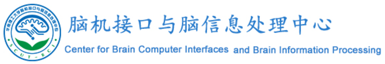

# Grouped Automatic Relevance Determination

by Tianyou Yu, Zhuliang Yu, Zhenghui Gu, and Yuanqing Li.

South China University of Technology


## Citation

If you use the code in your research, please cite:

```
@article{Yu2015,
    author = {Tianyou Yu and Zhuliang Yu and Zhenghui Gu and Yuanqing Li},
    journal = {IEEE Transactions on Neural Systems and Rehabilitation Engineering},
    title = {Grouped Automatic Relevance Determination and Its Application in Channel Selection for P300 BCIs},
    year = {2015},
    volume = {23},
    number = {6},
    pages = {1068-1077},
}
```

## To run the code, you should

1. Download the "Data set II in BCI Competition III (2005)" from the BCI competition website: http://www.bbci.de/competition/iii/.

2. Edit file "saveFeature.m". Change the "datapath" variable according to your local settings. Run this script first.

3. Run "mainTest1.m" to obtain the results.